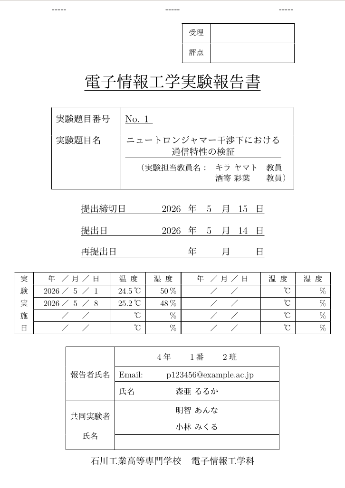

<h1 align="center"> 電子情報工学実験 レポートの TeX 版表紙</h1>

<h3 align="center"><strong>電子情報工学実験のレポート表紙の TeX 版スタイルファイルが遂に実装</strong></h3>

<div align="center">

[](https://github.com/Samemaru07/report-cover_tex/releases/latest)
[](https://github.com/Samemaru07/report-cover_tex/actions/workflows/cicd.yml)
[](./LICENSE)\


</div>

<div align="center">
コマンドに引数を渡すだけで指定書式に準拠した美しい表紙を生成でき、出力後は余白・フォント設定が自動でリセットされるため、本文はそのまま同じファイルに書き続けられます。
</div>

---

## 使い方

1. Releasesページから最新の `report-cover.sty` をダウンロードし、プロジェクトルートに移動。
    > [!IMPORTANT]
    > スタイルファイル冒頭の、ドメイン名の変数を書き換えてください。
2. プリアンブルに `\usepackage{report-cover}` コマンドを記入し、スタイルファイルを読み込む。
3. [コマンド一覧](#コマンド一覧)セクションより、`document` 環境内でコマンドに各値を与える。
4. `\makecover` コマンドを用いて表紙を出力。

### エンジン別の注意点

> 本スタイルファイルは、更新が行われる可能性があります。
> お手数ですが、定期的にこのリポジトリを確認してください。

<details>
<summary><strong>upLaTeX</strong></summary>

- js 系クラス (`jsarticle`, `jsreport` 等) を使用する場合、`nomag` オプションが必要です。

```tex
\documentclass[a4paper, 11pt, nomag]{jsarticle}
```

- `jsarticle.cls` 内部処理に起因する以下の警告が出ますが、出力への影響はありません。

```
LaTeX Font Warning: Font shape `OT1/cmr/m/n' in size <9.59998> not available size <10> substituted
LaTeX Font Warning: Size substitutions with differences up to 0.40002pt have occurred.
```

</details>

<details>
<summary><strong>XeLaTeX</strong></summary>

- bxjs 系クラス (`bxjsarticle`, `bxjsreport` 等) を使用する場合、`nomag` オプションが必要です。

```tex
    \documentclass[a4paper, 11pt, nomag]{bxjsarticle}
```

- bxjs 系クラスを使用する場合、`\geometry` に `reset` オプションが必要です。

```tex
    \geometry{reset, top=25mm, bottom=25mm, left=25mm, right=25mm}
```

</details>

### コマンド一覧

未入力の場合は空欄として出力されます。

|          項目          |                        コマンド                         |                                                    引数                                                    | 備考                                                       |
| :--------------------: | :-----------------------------------------------------: | :--------------------------------------------------------------------------------------------------------: | ---------------------------------------------------------- |
|      実験題目番号      |                    `\exnumber{番号}`                    |                                            番号を数字のみで入力                                            |                                                            |
|       実験題目名       |                   `\extitle{題目名}`                    |                                                 題目を入力                                                 | `\\` を入力することで、題目内改行が可能。                  |
|     実験担当教員名     |           `\teachers{教員名1, 教員名2, ...}`            |                        実験担当教員名をカンマ区切りで指定する。複数人の指定が可能。                        | 姓名間の空白も反映されます。                               |
|       提出締切日       |                `\deadlinedate{YYYYMMDD}`                |                                              西暦8ケタで入力                                               | 1ケタ台の月日な場合、自動で十の位の0が抜けます。           |
|         提出日         |                 `\submitdate{YYYYMMDD}`                 |                                              西暦8ケタで入力                                               | 1ケタ台の月日な場合、自動で十の位の0が抜けます。           |
|        再提出日        |                `\resubmitdate{YYYYMMDD}`                |                                              西暦8ケタで入力                                               |                                                            |
|       実験実施日       | `\exdates{YYYYMMDD/温度/湿度, YYYYMMDD/温度/湿度, ...}` | 西暦8ケタ, 温度, 湿度のセットをスラッシュ区切りにし、複数回分をカンマ区切りで指定する。最大8回分まで対応。 | 入力したケタ数で表示されます。有効数字の補正はありません。 |
| 報告者の学年・番号・班 |              `\reporterclass{年}{番}{班}`               |                                            学年, 番号, 班を指定                                            |                                                            |
|  報告者の Email・氏名  |             `\reportername{ユーザ名}{氏名}`             |                           第1引数にメールアドレスのユーザ名, 第2引数に氏名を入力                           | ドメイン名は不要です。姓名間の空白も反映されます。         |
|     共同実験者氏名     |          `\partnernames{氏名1, 氏名2, 氏名3}`           |                        共同実験者の氏名をカンマ区切りで指定する。最大3名まで対応。                         | 姓名間の空白も反映されます。                               |

### 最小構成の例

```tex
% LuaLaTeX です
\documentclass[a4paper,12pt]{ltjsreport}
\usepackage{report-cover}

% 表紙以降のスタイル
\geometry{top=25mm, bottom=25mm, left=25mm, right=25mm}

\begin{document}

% 表紙の各値
\exnumber{1}
\extitle{サンプルです}
\teachers{石川 太郎, 山田 花子}
\deadlinedate{20260515}
\submitdate{20260514}
\resubmitdate{}
\exdates{20260501/24.5/50, 20260508/25.2/48}
\reporterclass{4}{1}{2}
\reportername{p123456}{石川 一郎}
\partnernames{鈴木 誠, 石川 高専}

% 表紙の出力
\makecover

% ここから本文
% 自動でページカウンタがリセットされます

\end{document}

```

---

> [最小構成の例](#最小構成の例)セクションでコンパイルしたサンプル PDF: [sample.pdf](./sample.pdf)



---

## ディレクトリ構造

```
.
├ report-cover.sty    # 表紙スタイルファイル (本体, これをダウンロードしてください)
├ cover.tex           # スタイルファイルを使わず直書きした TeX ファイル (参考用)
├ main.tex            # スタイルファイルを適用した TeX ファイル (使用例)
├ sample.pdf          # コンパイル済みサンプル
├ sample.png          # サンプルのスクリーンショット (README 用)
├ .github/workflows/
│   └ cicd.yml        # CIを行うワークフローファイル
├ test_*.tex          # CIに用いるテストコード
├ LICENSE
└ README.md
```

---

## 特徴

### コマンドだけで、表紙が完成

情報をコマンドの引数に入力し、`\makecover` を1行書くだけで、指定書式に沿った表紙が出力されます。
レイアウトを自分で組む必要はありません。

### 年月日が漢字で縦に揃う

某 Office ソフトでは、年月日を入力したら、レイアウトが崩れて直すのが大変ですよね。
「年」「月」「日」の漢字を基準に列が揃うため、1桁の月・日でも表示が崩れません。
また、日付が未入力の場合は自動で空欄として出力されます。

### 担当教員名が複数人でも対応

`\teachers{}` にカンマ区切りで複数の教員名を入力できます。
複数人の場合、「教員」の文字を基準に縦揃えで整形されます。

### 本文と表紙が完全に独立

表紙内のフォント・余白設定は、本文側の設定に干渉しません。
逆に、本文側で設定したフォントや余白も、表紙には影響しないように設計されています。

### LuaLaTeX / upLaTeX / XeLaTeX に対応

主要な日本語 $\TeX$ エンジン3種に対応しています。

その他技術的なこだわりは、以下のZennにて解説しています！

[Zenn-パチモンのTeX製実験レポート表紙を作ったら、公式に採用されて本物になった話【スタイルファイル】](https://zenn.dev/samemaru07/articles/report-cover-tex)

## ライセンス・連絡先

[CC BY-NC-SA 4.0](./LICENSE) © 2026 中山 将吾

不具合・改善要望は Teams または Issue でお知らせください。
